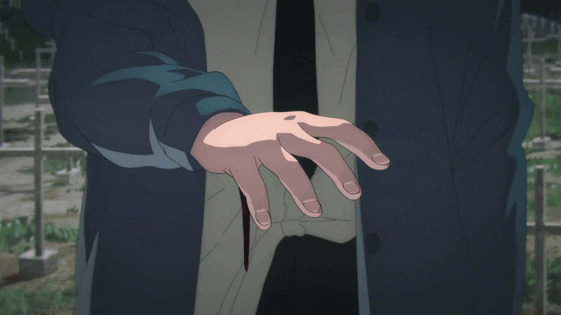

<table border="0">
  <tr>
    <td width="40%" align="center" valign="top">
      
      <h2><code>MOHAMED</code></h2>
      

         
        
      

      
<b>I BUILD SCALABLE SYSTEMS</b>

    </td>

    <td width="60%" valign="top">
      <blockquote>
        <code>"The code you write today is the technical debt you pay tomorrow. Sharpen your blade."</code>
      </blockquote>

      <h3><code>01 CAREER_PATH</code></h3>
      
SWE Masters student from Tunisia w/ 3+ years building full-stack apps. I architect first & code later. 2x Hackathon winner.

      
Currently interning @<b>hi-interns</b>

      <h3><code>02 TECH_STACK</code></h3>
      

         
        
        
        
        
        
        
      

      <h3><code>03 CONNECT</code></h3>
      

        
        
        
      

    </td>
  </tr>
</table>

